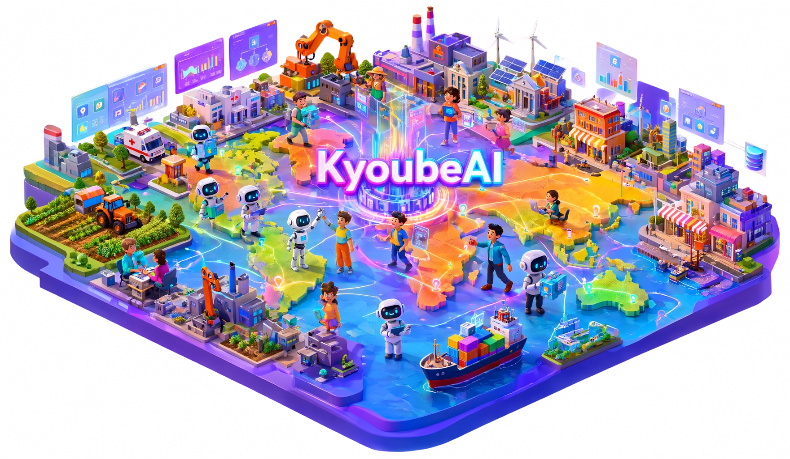

# KyoubeAI

[](LICENSE)

**An AI operating system for organisations to create AI employees, AI native mini-apps in a multi-user collaborative environment with extensive connectivity & integrations.**

<p align="center">
  
</p>

## Contents

- [Install](#install)
- [Update](#update)
- [Back up and restore](#back-up-and-restore)
- [Using KyoubeAI](#using-kyoubeai)
- [How it stays upstream-compatible](#how-it-stays-upstream-compatible)
- [Repository layout](#repository-layout)
- [Development](#development)
- [Roadmap](#roadmap)
- [Licence](#licence)

## Install

These steps take you from nothing to a running instance with its first agent. You can run the
**published image**, which Docker downloads from GHCR, or build the image **from source** on your own
machine. The published image is the tested release, built for amd64 and arm64, and it is the right
choice unless you want to run your own changes or `main` between releases. Where the steps differ,
both ways are shown.

### What you need

- Docker Engine 24 or later with Docker Compose v2 (Docker Desktop includes both), on amd64 or arm64.
- At least 4 GB of RAM.
- `git` and `openssl`.
- Access to a model: an API key from Anthropic, OpenAI or OpenRouter, or a subscription you sign in
  to from the Terminal page in step 8.

### Step 1. Download KyoubeAI

Published image: clone the release you will run.

```bash
git clone --branch v1.0.0 https://github.com/jknigel/KyoubeAI.git
cd KyoubeAI
```

Git reports a "detached HEAD" here. That is expected, because the checkout is pinned to the release
tag.

From source: clone `main`.

```bash
git clone https://github.com/jknigel/KyoubeAI.git
cd KyoubeAI
```

### Step 2. Create your settings file

`.env` holds your settings and secrets. Create it from the template and fill the three required
secrets with random values:

```bash
cp .env.example .env
for key in BETTER_AUTH_SECRET POSTGRES_PASSWORD KYOUBE_DB_PASSWORD; do
  sed -i.bak "s/^$key=\$/$key=$(openssl rand -hex 32)/" .env
done
rm .env.bak
```

The loop only fills empty values, so running it twice is safe. To do it by hand instead, run
`openssl rand -hex 32` three times and paste one result after each of the three keys. The two
database passwords must contain only letters and digits, which is what that command produces.

Keep a copy of `.env` somewhere safe. Restoring a backup onto a new machine needs the same
`BETTER_AUTH_SECRET` and database passwords.

Two optional settings are worth adding while the file is open:

- A model provider key (`ANTHROPIC_API_KEY`, `OPENAI_API_KEY` or `OPENROUTER_API_KEY`), so agents can
  work as soon as KyoubeAI starts.
- `KYOUBE_PUBLIC_URL`, if people will open KyoubeAI from other machines
  ([Reaching KyoubeAI from other machines](#reaching-kyoubeai-from-other-machines)).

### Step 3. Point `.env` at the published image

Skip this step if you build from source.

Near the bottom of `.env`, under "Optional: prebuilt image", uncomment the two lines so they read:

```bash
KYOUBE_IMAGE=ghcr.io/jknigel/kyoubeai
KYOUBE_VERSION=1.0.0
```

This command does the same:

```bash
sed -i.bak -e 's/^# KYOUBE_IMAGE=/KYOUBE_IMAGE=/' -e 's/^# KYOUBE_VERSION=/KYOUBE_VERSION=/' .env && rm .env.bak
```

The version must match the tag you cloned.

### Step 4. Start KyoubeAI

Published image: download the image, then start.

```bash
docker compose pull
docker compose up -d
```

Run the pull on its own and read how it ends. If it reports `denied`, stop there: the image is not
public, or this machine has to log in to GHCR first
([the published image on GHCR](docs/operations.md#the-published-image-on-ghcr)). A
`docker compose up -d` after a failed pull quietly builds the image from source instead.

From source: build and start in one go.

```bash
docker compose up -d --build
```

Then watch the services come up:

```bash
docker compose ps
```

Wait until `app` reads `healthy`. The first start runs the database migrations, and the health check
allows up to three minutes for them.

### Step 5. Sign up and claim the instance

Open http://localhost:3100 (or the `KYOUBE_PUBLIC_URL` you set), sign up, and claim the instance.
Whoever claims it becomes the instance admin.

The first-run wizard then sets up your company and its first agent. On its **Connect a model** step,
an API key works straight away. A Claude or OpenAI subscription cannot be signed in from the wizard on
a KyoubeAI server, so if you have no key, choose **Skip for now and connect the harness later from the
Terminal page**. The agent is created anyway, and it starts working once its harness is connected in
step 8.

The browser claim only works while `KYOUBE_DEPLOYMENT_EXPOSURE=private`, which is the default. For an
instance on the internet, claim it first and switch to `public` afterwards.

### Step 6. Install the Kyoube plugins

Run this once:

```bash
docker compose exec app kyoube setup
```

It prints a link and asks you to approve the command-line login as an instance admin. Open the link
in the browser where you are signed in and approve it before it expires. From then on the plugins
install and upgrade themselves every time KyoubeAI starts.

### Step 7. Check the installation

```bash
docker compose exec app kyoube doctor
```

Every check should pass, and each `kyoube.*` plugin should read `=ready`. The harness credential lines
at the end only report what is signed in, so they say "not found" until the next step.

### Step 8. Connect the agent harnesses

Agents work through Claude Code, pi or Hermes Agent, and each harness needs access to a model. Use
either way, or both:

- API keys: put `ANTHROPIC_API_KEY`, `OPENAI_API_KEY` or `OPENROUTER_API_KEY` in `.env`, then run
  `docker compose up -d` to apply them.
- Signing in from the browser: open the **Workspace** page at the bottom of the sidebar, then
  **Terminal**, and run `claude login` for Claude Code, `pi` for pi, or `hermes setup` for Hermes
  Agent. The credentials are stored on the `kyoubeai-home` volume, so they survive restarts and
  updates.

Run `kyoube doctor` again to see the harnesses you connected.

To let an agent work with company data, enable the **Kyoube Data** and **Kyoube Apps** skills on its
**Skills** tab and give it an access level under **Company Settings → Data access**. [Data](#data)
explains the levels.

### Reaching KyoubeAI from other machines

KyoubeAI listens on every network interface, so other machines can already reach it on port 3100.
Tell it the address people will use:

1. Set `KYOUBE_PUBLIC_URL` in `.env` to the exact address people type, such as
   `http://192.168.1.10:3100` or `https://kyoube.example.com`. Sign-in and the `kyoube setup` link are
   built from it, so a wrong value sends people to the wrong host.
2. Behind a reverse proxy or tunnel on the same Docker network (Caddy, Traefik, nginx or cloudflared),
   also set `TRUST_PROXY=uniquelocal`.
3. For an instance on the internet, put TLS in front and set `KYOUBE_DEPLOYMENT_EXPOSURE=public`.
   `kyoube doctor` fails a public instance whose address does not start with `https://`.
4. Apply the changes with `docker compose up -d`.

To use a port other than 3100, set `KYOUBE_PORT` and put the same port in `KYOUBE_PUBLIC_URL`. On a
`localhost` or `127.0.0.1` address, also set `BETTER_AUTH_TRUSTED_ORIGINS` to that origin (for
example `http://localhost:3199`). The core maps a loopback address back to its internal port and
would otherwise reject sign-ins from the new one.

### Troubleshooting

| What you see                                                         | What to do                                                                                                                                                                         |
| -------------------------------------------------------------------- | ---------------------------------------------------------------------------------------------------------------------------------------------------------------------------------- |
| `docker compose pull` reports `denied`                           | The image is not public yet, or this machine must log in to GHCR ([how](docs/operations.md#the-published-image-on-ghcr)). Do not run `docker compose up -d` until the pull works. |
| Sign-in fails with a 403 or an origin error                          | `KYOUBE_PUBLIC_URL` must match the address in the browser exactly. On another localhost port, set `BETTER_AUTH_TRUSTED_ORIGINS`; behind a proxy, set `TRUST_PROXY`.          |
| "Browser first-admin claim is not available"                         | `KYOUBE_DEPLOYMENT_EXPOSURE` is `public`. Set it to `private`, run `docker compose up -d`, claim the instance, then switch back.                                           |
| The build stops at the core-patches step and names two core versions | `KYOUBE_CORE_VERSION` in `.env` is left over from an older release. Copy the value from `.env.example` and build again.                                                      |
| `kyoube doctor` shows a plugin that is not `=ready`              | Read the plugin's log under**Settings → Plugins → *plugin* → Logs**, and `docker compose logs -f app`.                                                                |

## Update

Updates keep your data, and the plugins upgrade themselves on the next start. Databases only migrate
forward, though, so take a backup before every update: restoring it is the only way back.

The newest release is at the top of [CHANGELOG.md](CHANGELOG.md), and every release has a
`v<version>` tag. The examples below move from 1.0.0 to 1.0.1; use the versions you are moving
between.

### Updating a published-image install

1. Back up.

   ```bash
   bash scripts/backup.sh
   ```
2. Check out the new release, so `docker-compose.yml`, the scripts and `.env.example` match the image
   you are about to pull.

   ```bash
   git fetch --tags
   git checkout v1.0.1
   ```
3. See which settings the release added or changed, and copy any new ones into your `.env`.

   ```bash
   git diff v1.0.0 v1.0.1 -- .env.example
   ```
4. In `.env`, change the `KYOUBE_VERSION=` line under `KYOUBE_IMAGE` to the new version (`1.0.1`).
5. Download the new image, and check that the pull succeeded before you go on.

   ```bash
   docker compose pull
   ```
6. Restart on the new image and check it.

   ```bash
   docker compose up -d
   docker compose exec app kyoube doctor
   ```

   Every `kyoube.*` plugin should read `=ready` at its new version. `docker compose logs -f app`
   shows the plugins upgrading.

### Updating a source install

1. Back up.

   ```bash
   bash scripts/backup.sh
   ```
2. Pull the new code.

   ```bash
   git pull
   ```
3. Bring `.env` up to date. `git pull` never changes `.env`, and the core version is pinned there too.

   ```bash
   grep '^KYOUBE_CORE_VERSION=' .env.example .env
   git diff ORIG_HEAD -- .env.example
   ```

   If the two `KYOUBE_CORE_VERSION` values differ, copy the one from `.env.example` into `.env`: a
   build on the old core stops at the core-patches step. The `git diff` lists any other settings the
   update added.
4. Rebuild, restart and check.

   ```bash
   docker compose up -d --build
   docker compose exec app kyoube doctor
   ```

### Rolling back

If an update goes wrong, go back to the version you came from and restore the backup you took before
updating:

```bash
git checkout v1.0.0
# Published image: set KYOUBE_VERSION back to 1.0.0 in .env, then
docker compose pull && docker compose up -d
# From source: docker compose up -d --build
bash scripts/restore.sh backups/<timestamp>
docker compose exec app kyoube doctor
```

On a source install, check out the commit you were on before `git pull` (`git reflog` lists it).
The restore replaces both databases and the home volume, so anything written since the backup is
lost. [docs/upgrading.md](docs/upgrading.md) has the details, and covers moving KyoubeAI to a new
core release yourself.

## Back up and restore

`bash scripts/backup.sh` writes both database dumps, the cluster-level Kyoube roles and the
`/kyoubeai` home volume (agent credentials and workspaces) to `backups/<timestamp>/`.
`bash scripts/restore.sh backups/<timestamp>` puts all of it back, onto this machine or a new one. The
app is stopped while the restore runs, and everything written since the backup is replaced.

Keep a copy of `.env` with your backups, because a restore onto a new machine needs the same
`BETTER_AUTH_SECRET` and database passwords. [docs/operations.md](docs/operations.md) covers nightly
backups with cron, off-site copies, logs, health checks, rotating the board key and resource limits.

## Using KyoubeAI

### Studio

KyoubeAI opens dark, in the palette and type of the KyoubeAI website. The sidebar keeps what you use
every day: a search field, one **New task** button, Home, Inbox, Tasks and Projects, a **Build** group
(Data, Apps, Routines) and a **Team** roster where every agent has a face, a live status dot and a line
saying what it is doing. Everything else is on the **Workspace** page at the bottom of the sidebar, and
still one ⌘K away: All agents and the org chart, Audit, Timeline, Costs, Approvals, Skills, Artifacts,
Connectors, Settings, and for owners and admins Plugins and Terminal.

**Home** replaces the top half of the stock dashboard. It shows how many things need you, a
getting-started strip for new workspaces, **Needs you** (approvals, reviews, blocked tasks, agents in
error), **Your team right now** and **Latest updates**, with the core's metrics and charts below. An
agent's face comes from its name and the icon picked in its settings.

Each agent has a **profile** (`/<company>/team/<agent>`) with its character and status, whom it
reports to, an **On duty** switch, **Chat** and **Assign task**, what it is working on now with its
latest notes, recent work, the week's numbers, its skills and who it works with. Every link to an
agent opens the profile. Its Instructions, Skills and Settings tabs open the core's own agent views,
and Runs opens the agent's runs under Audit.

Studio has two parts, and neither edits the core: `docker/theme/` (a build-time stylesheet, boot flag
and label renames, checked against every core bump) and the `kyoube.studio` plugin. Without the
plugin, the app falls back to the stock layout. [docs/theme.md](docs/theme.md) has the details.

### Terminal

Company owners and admins see a **Terminal** card on the **Workspace** page. It opens a shell inside
the `app` container as the `node` user with `HOME=/kyoubeai` (the persisted volume), so `claude login`,
`pi` and `hermes setup` store credentials that survive restarts. Sessions are audited (open, close
and kill, never content), idle sessions close after 30 minutes, and a session survives page reloads:
use **attach** under *Sessions in this company*. Roles, timeouts and the shell are set under
**Settings → Plugins → Kyoube Terminal**.

The terminal is equivalent to shell access to the whole instance, including the database credentials
and every agent's tokens. Keep `allowedRoles` tight, and use it only over a private network or TLS.
The security model is in [SECURITY.md](SECURITY.md#terminal).

### Data

Every company gets its own isolated PostgreSQL schema in the `kyoube` database, separate from the
core's own database. People use it from the **Data** page. Agents use the REST routes under
`/api/plugins/kyoube.apps/api/` with the `PAPERCLIP_API_URL`, `PAPERCLIP_API_KEY` and
`PAPERCLIP_COMPANY_ID` every run already carries, guided by the managed **Kyoube Data** skill. The same
operations exist as `kyoube.apps:data_*` tools, but the core (2026.831.1 through 2026.916.1) only hands
those to a run through an MCP gateway, which it creates only for agents that already have an MCP
connection, so the skill leads with the API.

Giving an agent access takes two steps. The **Kyoube Data** and **Kyoube Apps** skills reach every
company's skill library by themselves: `kyoube ensure-plugins` installs them into every company at
each container start, the first visit to a company's pages does the same, and a company created later
gets them on creation (`kyoube setup` and `kyoube doctor` confirm it). Then, for each agent, enable the
skills on its **Skills** tab and grant a level under **Company Settings → Data access**. Enabling a
skill only puts its text in front of the agent; nothing runs until a task calls for company data.

Access levels are `none < read < write < schema`. People inherit theirs from their company role, and
agents get an explicit level or the company default (`none`). Dropped tables and fields are kept for
30 days unless hard deletes are enabled. Every mutation is audited in `kyoube_meta.audit` and
summarised in the activity log.

Read-only SQL (`data_sql_select`, `POST /sql`) may reference only that company's own tables, by bare
name. Schema-qualified names, Postgres catalogs and `information_schema` are rejected before the query
runs, so introspection goes through `data_describe_table`. A query may also call only an allowlist of
pure built-in functions (aggregates, string, maths and date helpers, JSON and array helpers, window
functions), with no `pg_*` function and no cast to a `reg*` OID alias type.

The core's tool policies (Tools & Access) can require human approval for
`kyoube.apps:data_drop_table` and `kyoube.apps:data_remove_field`. Those policies only see calls that
go through the core's MCP gateway, though. An agent calling the REST routes is governed by its Kyoube
access level alone, so keep builders at `write` until you trust them with `schema`. Recommended
policies are in [docs/governance.md](docs/governance.md).

### Apps

Apps are single-file HTML applications that run inside the KyoubeAI UI (`/<company>/app-artifact`;
the sidebar entry is **Apps**) and use the company's Data tables through an injected `window.kyoube`
SDK. Agents build and publish them through the same REST routes, or the `kyoube.apps:apps_*` tools
where a gateway exists, guided by the managed **Kyoube Apps** skill. People can review an app's source
and versions, publish, and roll back from the app page.

A Content-Security-Policy blocks all network access from an app. Apps run at an opaque origin with no
cookies and no storage, and they can never exceed the permissions of the person using them. The
authoring guide is [docs/apps.md](docs/apps.md).

### Files

Every project has a working folder: the workspace configured on the project or, when there is none,
the folder the core creates the first time an agent works on one of its tasks
(`/kyoubeai/instances/default/projects/<companyId>/<projectId>/_default`). Agents run in that folder,
and what they write there is the project's work product. The **Files** tab on a project page, and the
**Files** link under each project in the sidebar, show that folder to people. You can open and edit
text files, preview Markdown, images and SVG, create files and folders, upload, download, rename and
delete.

An HTML file opens as the page it is, rendered in a sandboxed frame with no network, with the
stylesheets, scripts and images it references from the same folder inlined. A **View/Edit source**
toggle shows the markup. The listing and any open file refresh themselves every few seconds, so an
agent's changes appear as they land. A save carries the modification time the file had when it was
opened and is refused if an agent changed it since, with a choice to reload or overwrite. Symbolic
links are listed but never followed, and no path can leave the project folder.

The same folder is one click away while you work with an agent. On any task that belongs to a
project, a folder icon at the right end of the top bar (the one that reads *Tasks › BAP-12 …*) docks
the project folder in a panel on the right of the screen, with the same browser and editor. The panel
has no backdrop, so the chat stays usable beside it, and it follows you from task to task, switching
to each task's project, until you close it.

Who may do what is a per-instance setting (**Settings → Plugins → Kyoube Files**). By default every
company role can browse and download, and everyone but `viewer` can change files. Files larger than
1 MiB open as download-only, and single uploads are capped at 5 MiB (the core's JSON body limit keeps
the ceiling at 7); larger transfers belong in the Terminal or with an agent. Every change is written to
the company's activity log with its path, never its content.

## How it stays upstream-compatible

- The image is built `FROM` a pinned upstream release of the core (`KYOUBE_CORE_VERSION`),
  and nothing in this repository is core source. At build time the core gets presentation-only
  transforms that are re-applied to the pristine layer on every build and fail it when upstream moves
  what they rely on: the branding in `docker/rebrand/` ([docs/branding.md](docs/branding.md)) and the
  Studio theme in `docker/theme/` ([docs/theme.md](docs/theme.md)), plus any temporary bug fix in
  `docker/core-patches/` while its upstream fix is pending.
- Every Kyoube feature is a plugin (`kyoube.terminal`, `kyoube.apps`, `kyoube.files`,
  `kyoube.studio`) built only against the published `@paperclipai/plugin-sdk`, with no imports from
  the core's own server or UI source and no undocumented routes.
- `KYOUBE_CORE_VERSION` and the plugin SDK version are pinned together across the Dockerfile,
  `.env.example`, `scripts/smoke.env`, `docker-compose.yml` and every plugin's `package.json`.
  `scripts/check-pins.sh` fails CI as soon as any of them drift apart, and
  `scripts/bump-core.sh <version>` bumps them all in one pass.
- The image sets `DO_NOT_TRACK=1` and `DISABLE_TELEMETRY=1` in the container, and the terminal plugin
  sets the same two in every shell it spawns (which does not inherit the container's environment).
  That turns off the core's own telemetry, which is on by default, and Claude Code's, in the server
  and in a Terminal session alike. The image still bundles third-party harnesses this project does not
  build, so it is not telemetry-free; what was verified, and what could not be, is in
  [SECURITY.md](SECURITY.md#telemetry).
- A weekly CI job (`upstream-beta`) builds and smoke-tests this repository against the core image's
  `:beta` channel, and opens an issue as soon as something upstream would break the plugins, before it
  reaches a stable version bump.

[docs/architecture.md](docs/architecture.md) has the full upgrade contract, and
[docs/upgrading.md](docs/upgrading.md) the bump procedure.

## Repository layout

| Path                                                | What it is                                                                                 |
| --------------------------------------------------- | ------------------------------------------------------------------------------------------ |
| `docker/Dockerfile`                               | Overlay image: the upstream core, pinned`claude`, `pi` and `hermes` CLIs, and Kyoube |
| `docker/bootstrap/`                               | The`kyoube` CLI (`setup`, `ensure-plugins`, `doctor`)                              |
| `plugins/`                                        | Core plugins (`kyoube-terminal`, `kyoube-apps`, `kyoube-files`, `kyoube-studio`)   |
| `docker/theme/`                                   | The build-time Studio theme: tokens, a gated skin, label renames (`docs/theme.md`)       |
| `docker/rebrand/`                                 | The build-time branding transform (`docs/branding.md`)                                   |
| `docker/core-patches/`                            | Temporary fixes for upstream bugs, applied at build time until upstream ships them         |
| `packages/kyoube-app-sdk/`                        | `window.kyoube`, the SDK injected into every app                                         |
| `docker-compose.yml`                              | `app` and `db` (Postgres 17 with the databases `kyoubeai` and `kyoube`)            |
| `scripts/smoke.sh`                                | End-to-end smoke test used by CI                                                           |
| `scripts/backup.sh`, `scripts/restore.sh`       | Backup and restore of both databases, the Kyoube roles and the home volume                 |
| `scripts/check-pins.sh`, `scripts/bump-core.sh` | Keep the core image and plugin SDK version pins in lock-step                               |
| `docs/architecture.md`                            | Trust zones, request paths, the data model and the upgrade contract                        |
| `docs/apps.md`                                    | App authoring guide (manifest,`window.kyoube`, security model)                           |
| `docs/operations.md`                              | Volumes, backups, restore, logs, health, key rotation, limits                              |
| `docs/upgrading.md`                               | Upgrading KyoubeAI and the core, and rolling back                                          |
| `docs/governance.md`                              | Recommended agent tool profiles and policies                                               |
| `SECURITY.md`                                     | The security model and how to report a vulnerability                                       |
| `CONTRIBUTING.md`                                 | Local setup, conventions, and how to add a tool                                            |

## Development

```bash
pnpm install     # plain pnpm switches to the pinned version itself; `corepack enable` first is optional
pnpm test        # unit tests for the bootstrap CLI and plugins
pnpm build       # builds dist/ for every package
pnpm smoke       # full docker smoke test (needs docker, curl, jq)
```

[CONTRIBUTING.md](CONTRIBUTING.md) covers the integration test setup, commit conventions and how to
add a tool.

## Roadmap

These were left out of 1.0, roughly in order of how often they come up:

- Multi-file apps. An app is one HTML document today; multi-file and multi-page bundles would build
  on the existing version storage.
- Realtime table updates. Apps re-query for fresh data. A `data.subscribe` call in the app SDK
  (polling under the hood, at first) is designed but not built.
- `ui.confirm` and `theme` in the app SDK, and a **Preview draft** button so a person can preview an
  unpublished app version without publishing it.
- Dashboard-widget apps. The core's UI slot exists, but an app manifest's `surfaces` are not wired to
  it yet.
- An upstream proposal to let operators configure the core's bundled-plugin allowlist, so the one-time
  `kyoube setup` step is no longer needed on first boot.

## Licence

KyoubeAI is source-available under the [Business Source License 1.1](LICENSE). You can read, change
and redistribute the code, and use it for evaluation, development and testing without limit.

Production use is free for up to five users across your instances, as long as you do not offer
KyoubeAI to others as a hosted, managed or embedded service. AI agents do not count as users.
Anything beyond that needs a commercial licence: self-hosted for more users, hosted by us, or
enterprise terms. Plans and prices are at [kyoubeai.com/pricing](https://kyoubeai.com/pricing).


Four years after each version is published, that version becomes available under the Apache License,
Version 2.0. [LICENSE](LICENSE) is the binding text, [NOTICE.md](NOTICE.md) has the copyright line and
the third-party notices, and contributions need the agreement in [CLA.md](CLA.md).
