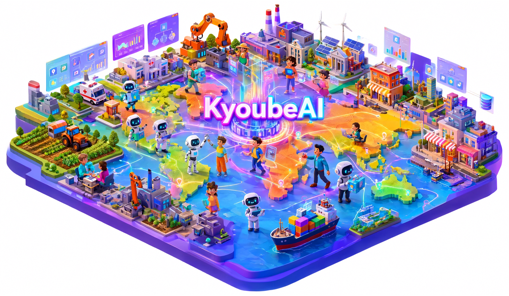

# KyoubeAI

[](LICENSE)

**An AI operating system for organisations to create AI employees, AI native mini-apps in a multi-user collaborative environment with extensive connectivity & integrations.**

<p align="center">
  
</p>

## Contents

- [Install](#install)
- [Update](#update)
- [Harnesses](#harnesses)
- [Back up and restore](#back-up-and-restore)
- [Using KyoubeAI](#using-kyoubeai)
- [Development](#development)
- [Roadmap](#roadmap)
- [Licence](#licence)

## Install

### What you need

- Docker Desktop (macOS, Windows) or Docker Engine 24 or later with Docker Compose v2.17 or later
  (Linux), on amd64 or arm64, with at least 4 GB of memory for Docker. On Windows, run the commands
  below in WSL2.
- `git`.
- A model for your agents: an API key from Anthropic, OpenAI or OpenRouter, or a subscription you
  connect after installing ([Harnesses](#harnesses)).

### Install

```bash
git clone https://github.com/jknigel/KyoubeAI.git
cd KyoubeAI
./install.sh
```

The script:

1. switches the checkout to the newest release;
2. writes `.env` with generated secrets, asking one question, the address people will use (Enter keeps
   `http://localhost:3100`; if that port is taken it asks for another);
3. downloads the release's image (about 3 GB);
4. starts KyoubeAI and waits until it is healthy;
5. asks you to open that address, create your account and claim the instance (the first account becomes
   the instance admin);
6. prints a link that installs the Kyoube plugins: open it in the same browser and approve it;
7. checks the result with `kyoube doctor`.

It is safe to run again at any point, and continues where it stopped. Re-running `./install.sh` repairs
the version you have; moving to another version is `./update.sh` (on an install that has data,
`./install.sh` refuses to change the version, before it changes anything). Keep a copy of `.env`
somewhere safe: restoring a backup onto a new machine needs its secrets.

After you claim the instance, the first-run wizard sets up your company and its first agent. On its
**Connect a model** step an API key works straight away. With only a Claude or OpenAI subscription,
choose **Skip for now and connect the harness later from the Terminal page**, which appears under the
step's error: the agent is created anyway. Then install the agent harnesses you want
([Harnesses](#harnesses)).

Options: `--url <address>` and `--port <n>` answer the address question, `--name <project>` names the
Compose project (for a second instance on one machine), `--yes` accepts every default and asks nothing
(a taken port then stops the script, so add `--port`), `--version <x.y.z>` installs a particular release
(1.1.0 or later), and `--edge` builds the current branch from source instead
([CONTRIBUTING.md](CONTRIBUTING.md)). People on other machines, TLS and reverse proxies are covered in
[docs/operations.md](docs/operations.md#reaching-kyoubeai-from-other-machines).

### Troubleshooting

| What you see | What to do |
| --- | --- |
| "Docker is installed but not reachable" | Start Docker Desktop. On Linux, start the daemon and add your user to the `docker` group, then log in again. |
| The download fails, or says `denied` | Check the network and run `./install.sh` again; completed layers are kept. `denied` means this machine cannot read the image ([docs/operations.md](docs/operations.md#the-published-image-on-ghcr)). |
| "did not become healthy" | Read the log lines it printed. `docker compose logs -f app` shows more. |
| Sign-in fails with a 403 or an origin error | The address in the browser must match `KYOUBE_PUBLIC_URL` in `.env` exactly. Behind a proxy, set `TRUST_PROXY` ([docs/operations.md](docs/operations.md#reaching-kyoubeai-from-other-machines)). |
| "blocks the browser claim" | `KYOUBE_DEPLOYMENT_EXPOSURE` is `public`. Set it to `private`, run `./install.sh`, claim, then switch back and run `docker compose up -d`. |
| `kyoube doctor` shows a plugin that is not `=ready` | Read the plugin's log under **Settings → Plugins → *plugin* → Logs**, and `docker compose logs -f app`. |

## Update

```bash
./update.sh
```

It downloads the newest release's image before it changes anything, then:

1. backs up (`scripts/backup.sh`);
2. switches the checkout to the new release;
3. adds any new settings to `.env` and moves `KYOUBE_VERSION` and `KYOUBE_CORE_VERSION` to the new
   release; your other settings are never changed;
4. restarts;
5. offers to install any harness your agents use that is not installed;
6. runs `kyoube doctor`.

`--version <x.y.z>` picks a release (not one older than the release you are on), and `--yes` answers every
question. An update that stops part way continues when you run `./update.sh` again, without a second
backup. Harnesses, their logins and kept system packages carry over ([Harnesses](#harnesses)).

If an update goes wrong, `./update.sh --rollback` goes back to the previous release and restores the
backup taken just before the update. Anything written since then is replaced, because databases only
migrate forward; the `.env` it replaces is kept as `.kyoube/env.before-rollback`. A rollback that stops
part way is finished by running `./update.sh --rollback` again.

An install built from source (`./install.sh --edge`) updates with `./update.sh --edge`, which
fast-forwards the current branch and rebuilds. [docs/upgrading.md](docs/upgrading.md) covers moving to
1.1 from an earlier install, and moving KyoubeAI to a new core release.

## Harnesses

Agents work through an agent harness: Claude Code, Codex, Hermes Agent, pi, Gemini CLI, OpenCode or Kimi
Code. You install the ones you want from the **Terminal** (the **Workspace** page, then **Terminal**, for
company owners and admins), the same way you would on your own machine.

What you install stays:

- Harnesses land in `/kyoubeai/.local`, on the `kyoubeai-home` volume, which comes first on the `PATH` of
  every agent and every Terminal shell.
- Their logins (`~/.claude`, `~/.codex`, `~/.hermes`, `~/.pi`, and so on) live on the same volume.
- System packages you add with `sudo apt install` are put back automatically after a restart, an update or
  a core upgrade.

All of it survives `docker compose down`, `./update.sh` and core upgrades, and `scripts/backup.sh`
carries it to a new machine. The Terminal runs as the same user as your agents and has `sudo`, so treat
Terminal access as root on the container ([SECURITY.md](SECURITY.md#terminal)).

```bash
kyoube harness install claude   # also: codex, hermes, pi, gemini, opencode, kimi
kyoube harness list             # what is installed, which version, and whether it is yours
```

`kyoube harness install` runs the harness's official installer. The core image carries its own copies of
Claude Code, Codex, Gemini CLI, Kimi Code and OpenCode as fallbacks; yours take precedence.
`kyoube doctor` flags any harness your agents use that is not installed or no longer runs. KyoubeAI has
no installer for Grok: install it from its own instructions so that `grok` lands in
`/kyoubeai/.local/bin`.

### How agents reach a model

- **AI connections** hold a subscription sign-in or an API key centrally, and hand it to each run. You add
  one from an agent's **Runtime** tab, under **AI connection**. Claude Code, Codex, OpenCode and Grok can
  use them.
- **The harness's own login**, made in the Terminal, or provider keys in `.env` (`ANTHROPIC_API_KEY`,
  `OPENAI_API_KEY`, `OPENROUTER_API_KEY`; `docker compose up -d` applies them). pi and Hermes always work
  this way; the others do for agents that have no AI connection.

### Claude Code

1. `kyoube harness install claude`. This is the official native installer, and it keeps Claude Code up to
   date.
2. Connect it, one of these ways:
   - **Pro or Max subscription, as an AI connection.** On the agent's **Runtime** tab, choose Claude Code,
     then add a Claude subscription under **AI connection**. It shows a command ending in
     `kyoube connect claude`. Paste it into the Terminal, sign in at the link it prints, and paste the code
     back (if it then asks for the token Claude printed, paste that). When the Terminal says *Done*, click
     **Connect**. The connection holds a one-year token; connect it again once a year.
   - **Anthropic API key:** add it as an AI connection, or set `ANTHROPIC_API_KEY` in `.env`.
   - **Just your own login:** run `claude` in the Terminal and use `/login`. Agents without an AI
     connection use it, and Claude keeps it refreshed.
3. Choose Claude Code and the connection on the agent's **Runtime** tab.

Claude subscription connections made before 1.1 hold an 8-hour token and stop working; connect them again
once, as above.

### Codex

1. `kyoube harness install codex`.
2. Add an OpenAI subscription (the page shows a device sign-in) or an OpenAI API key as an AI connection,
   or run `codex login` in the Terminal for agents without one.
3. Choose Codex on the agent's **Runtime** tab. Keep **Bypass sandbox** on: Codex's own sandbox needs
   kernel features a container does not have, and the container is the sandbox.

### Hermes Agent

1. `kyoube harness install hermes`.
2. Run `hermes setup` in the Terminal to pick a provider and model and enter keys (OpenRouter and others).
   Its settings, sessions and memory live in `~/.hermes`.
3. Choose Hermes on the agent's **Runtime** tab. Hermes does not use AI connections.

### pi

1. `kyoube harness install pi`.
2. Run `pi` in the Terminal and use `/login`, or put provider keys in `~/.pi`.
3. Choose pi on the agent's **Runtime** tab. pi does not use AI connections.

### Gemini CLI, OpenCode, Kimi Code

The core image carries a copy of each. `kyoube harness install gemini` (or `opencode`, `kimi`) installs
your own, newer copy, which then takes precedence. Sign in from the Terminal as each one's documentation
describes.

### Switching an agent's harness

On the **Runtime** tab, pick the new harness and, in the same save, an AI connection that works with it,
or none. The save is refused while the agent still has a connection for another provider. **Test** works
before you save.

### After an update or a core upgrade

`kyoube doctor` lists each installed harness and whether it still starts. One that no longer runs, for
example after the core moves to a new Node.js, shows its reinstall command. It also reports the kept
system packages, and fails if they could not be put back at the last start.

## Back up and restore

`bash scripts/backup.sh` writes both database dumps, the cluster-level Kyoube roles and the
`/kyoubeai` home volume (the board key, agent workspaces, your harnesses and their logins, and the list
of kept system packages; download caches are left out) to `backups/<timestamp>/`.
`bash scripts/restore.sh backups/<timestamp>` puts all of it back, onto this machine or a new one. The
app is stopped while the restore runs, and everything written since the backup is replaced.

Keep a copy of `.env` with your backups, because a restore onto a new machine needs the same
`BETTER_AUTH_SECRET` and database passwords. [docs/operations.md](docs/operations.md) covers nightly
backups with cron, off-site copies, logs, health checks, rotating the board key and resource limits.

## Using KyoubeAI

### Studio

KyoubeAI opens dark, in the palette and type of the KyoubeAI website. The sidebar keeps what you use
every day: a search field, one **New task** button, Home, Inbox, Tasks and Projects, a **Build** group
(Data, Apps, Routines) and a **Team** roster where every agent has a face, a live status dot and a line
saying what it is doing. Everything else is on the **Workspace** page at the bottom of the sidebar, and
still one ⌘K away: All agents and the org chart, Audit, Timeline, Costs, Approvals, Skills, Artifacts,
Connectors, Settings, and for owners and admins Plugins and Terminal.

**Home** replaces the top half of the stock dashboard. It shows how many things need you, a
getting-started strip for new workspaces, **Needs you** (approvals, reviews, blocked tasks, agents in
error), **Your team right now** and **Latest updates**, with the core's metrics and charts below. An
agent's face comes from its name and the icon picked in its settings.

Each agent has a **profile** (`/<company>/team/<agent>`) with its character and status, whom it
reports to, an **On duty** switch, **Chat** and **Assign task**, what it is working on now with its
latest notes, recent work, the week's numbers, its skills and who it works with. Every link to an
agent opens the profile. Its Instructions, Skills and Settings tabs open the core's own agent views,
and Runs opens the agent's runs under Audit.

Studio has two parts, and neither edits the core: `docker/theme/` (a build-time stylesheet, boot flag
and label renames, checked against every core bump) and the `kyoube.studio` plugin. Without the
plugin, the app falls back to the stock layout. [docs/theme.md](docs/theme.md) has the details.

### Agent working rules

An agent finishes the task you give it, asks you (and only you) when it needs approval, and moves
work up to a manager agent only when you decide it should. [docs/agent-rules.md](docs/agent-rules.md)
explains the rules, standing handoffs and how to turn them off.

### On your phone

KyoubeAI installs on phones and computers as an app, with push notifications when an agent needs you:
a question, an approval, or a task that is done or blocked. Each instance sends them itself, encrypted,
and it needs an `https://` address. [docs/mobile.md](docs/mobile.md) has the install steps and the
details.

### Terminal

Company owners and admins see a **Terminal** card on the **Workspace** page. It opens a login shell
inside the `app` container as the `node` user, with `HOME=/kyoubeai` (the persisted volume) and
passwordless `sudo`, so you can install and manage anything there: harnesses, their logins, and system
packages ([Harnesses](#harnesses)). Sessions are audited (open, close and kill, never content), idle
sessions close after 30 minutes, and a session survives page reloads: use **attach** under *Sessions in
this company*. Roles, timeouts and the shell are set under **Settings → Plugins → Kyoube Terminal**.

The terminal is equivalent to root access to the whole container, including the database credentials
and every agent's tokens. Keep `allowedRoles` tight, and use it only over a private network or TLS.
The security model is in [SECURITY.md](SECURITY.md#terminal).

### Data

Every company gets its own isolated PostgreSQL schema in the `kyoube` database, separate from the
core's own database. People use it from the **Data** page. Agents use the REST routes under
`/api/plugins/kyoube.apps/api/` with the `PAPERCLIP_API_URL`, `PAPERCLIP_API_KEY` and
`PAPERCLIP_COMPANY_ID` every run already carries, guided by the managed **Kyoube Data** skill. The same
operations exist as `kyoube.apps:data_*` tools, but the core (2026.831.1 through 2026.916.1) only hands
those to a run through an MCP gateway, which it creates only for agents that already have an MCP
connection, so the skill leads with the API.

Giving an agent access takes two steps. The **Kyoube Data** and **Kyoube Apps** skills reach every
company's skill library by themselves: `kyoube ensure-plugins` installs them into every company at
each container start, the first visit to a company's pages does the same, and a company created later
gets them on creation (`kyoube setup` and `kyoube doctor` confirm it). Then, for each agent, enable the
skills on its **Skills** tab and grant a level under **Company Settings → Data access**. Enabling a
skill only puts its text in front of the agent; nothing runs until a task calls for company data.

Access levels are `none < read < write < schema`. People inherit theirs from their company role, and
agents get an explicit level or the company default (`none`). Dropped tables and fields are kept for
30 days unless hard deletes are enabled. Every mutation is audited in `kyoube_meta.audit` and
summarised in the activity log.

Read-only SQL (`data_sql_select`, `POST /sql`) may reference only that company's own tables, by bare
name. Schema-qualified names, Postgres catalogs and `information_schema` are rejected before the query
runs, so introspection goes through `data_describe_table`. A query may also call only an allowlist of
pure built-in functions (aggregates, string, maths and date helpers, JSON and array helpers, window
functions), with no `pg_*` function and no cast to a `reg*` OID alias type.

The core's tool policies (Tools & Access) can require human approval for
`kyoube.apps:data_drop_table` and `kyoube.apps:data_remove_field`. Those policies only see calls that
go through the core's MCP gateway, though. An agent calling the REST routes is governed by its Kyoube
access level alone, so keep builders at `write` until you trust them with `schema`. Recommended
policies are in [docs/governance.md](docs/governance.md).

### Apps

Apps are single-file HTML applications that run inside the KyoubeAI UI (`/<company>/app-artifact`;
the sidebar entry is **Apps**) and use the company's Data tables through an injected `window.kyoube`
SDK. Agents build and publish them through the same REST routes, or the `kyoube.apps:apps_*` tools
where a gateway exists, guided by the managed **Kyoube Apps** skill. People can review an app's source
and versions, publish, and roll back from the app page.

A Content-Security-Policy blocks all network access from an app. Apps run at an opaque origin with no
cookies and no storage, and they can never exceed the permissions of the person using them. The
authoring guide is [docs/apps.md](docs/apps.md).

### Files

Every project has a working folder: the workspace configured on the project or, when there is none,
the folder the core creates the first time an agent works on one of its tasks
(`/kyoubeai/instances/default/projects/<companyId>/<projectId>/_default`). Agents run in that folder,
and what they write there is the project's work product. The **Files** tab on a project page, and the
**Files** link under each project in the sidebar, show that folder to people. You can open and edit
text files, preview Markdown, images and SVG, create files and folders, upload, download, rename and
delete.

An HTML file opens as the page it is, rendered in a sandboxed frame with no network, with the
stylesheets, scripts and images it references from the same folder inlined. A **View/Edit source**
toggle shows the markup. The listing and any open file refresh themselves every few seconds, so an
agent's changes appear as they land. A save carries the modification time the file had when it was
opened and is refused if an agent changed it since, with a choice to reload or overwrite. Symbolic
links are listed but never followed, and no path can leave the project folder.

The same folder is one click away while you work with an agent. On any task that belongs to a
project, a folder icon at the right end of the top bar (the one that reads *Tasks › BAP-12 …*) docks
the project folder in a panel on the right of the screen, with the same browser and editor. The panel
has no backdrop, so the chat stays usable beside it, and it follows you from task to task, switching
to each task's project, until you close it.

Who may do what is a per-instance setting (**Settings → Plugins → Kyoube Files**). By default every
company role can browse and download, and everyone but `viewer` can change files. Files larger than
1 MiB open as download-only, and single uploads are capped at 5 MiB (the core's JSON body limit keeps
the ceiling at 7); larger transfers belong in the Terminal or with an agent. Every change is written to
the company's activity log with its path, never its content.

## Development

```bash
pnpm install     # plain pnpm switches to the pinned version itself; `corepack enable` first is optional
pnpm test        # unit tests for the bootstrap CLI and plugins
pnpm build       # builds dist/ for every package
pnpm smoke       # full docker smoke test (needs docker, curl, jq)
pnpm test:sh     # bats tests for install.sh, update.sh and the container scripts
```

[CONTRIBUTING.md](CONTRIBUTING.md) covers the integration test setup, commit conventions and how to
add a tool.

## Roadmap

These were left out of 1.0, roughly in order of how often they come up:

- Multi-file apps. An app is one HTML document today; multi-file and multi-page bundles would build
  on the existing version storage.
- Realtime table updates. Apps re-query for fresh data. A `data.subscribe` call in the app SDK
  (polling under the hood, at first) is designed but not built.
- `ui.confirm` and `theme` in the app SDK, and a **Preview draft** button so a person can preview an
  unpublished app version without publishing it.
- Dashboard-widget apps. The core's UI slot exists, but an app manifest's `surfaces` are not wired to
  it yet.

## Licence

KyoubeAI is source-available under the [Business Source License 1.1](LICENSE). You can read, change
and redistribute the code, and use it for evaluation, development and testing without limit.

Production use is free for up to five users across your instances, as long as you do not offer
KyoubeAI to others as a hosted, managed or embedded service. AI agents do not count as users.
The limit is enforced in the app; a licence key from KyoubeAI raises it. See
[docs/licensing.md](docs/licensing.md).
Anything beyond that needs a commercial licence: self-hosted for more users, hosted by us, or
enterprise terms. Plans and prices are at [kyoubeai.com/pricing](https://kyoubeai.com/pricing).


Four years after each version is published, that version becomes available under the Apache License,
Version 2.0. [LICENSE](LICENSE) is the binding text, [NOTICE.md](NOTICE.md) has the copyright line and
the third-party notices, and contributions need the agreement in [CLA.md](CLA.md).
